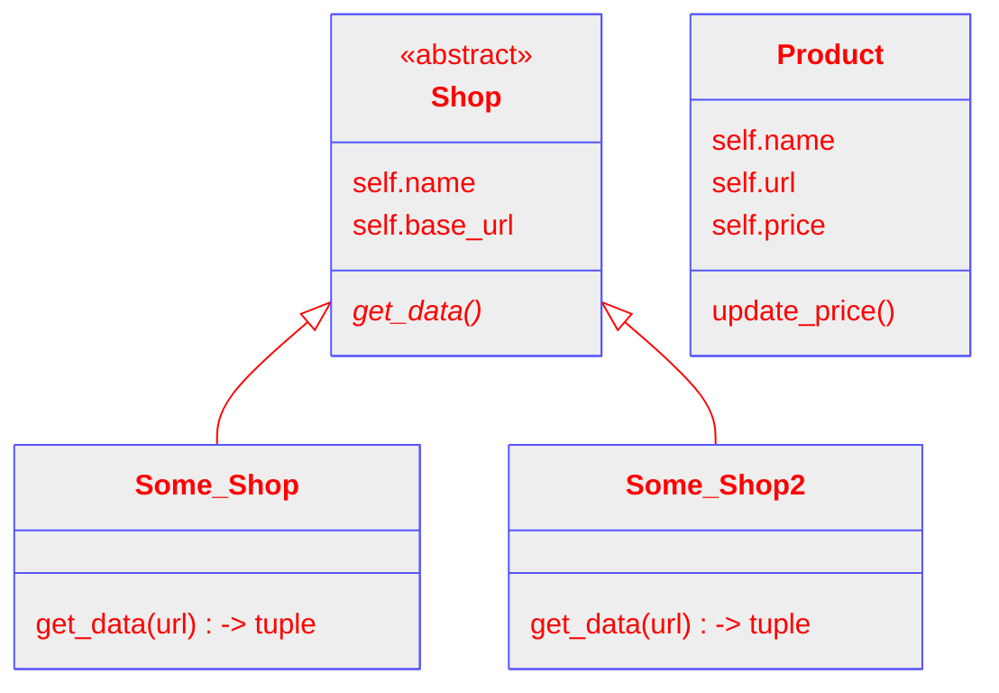

# Projektplanering - "I dno, nån prisfetcher-grej typ"

## Vad ska ditt program göra?

Mitt program ska, beroende på hur långt jag hinner:

```
    - Ta in data om produkter från en eller flera webbutiker.
    - Visa det för användaren i CLI.
    - Spara datan i en databas.
    - Kunna hämta data från databsen och visa den.
```

Det här är ju bara "the basic" base-caset. Det finns ju mycket man kan lägga till som jag spånar på längre ner. Men det är svårt att säga hur lång tid något kommer ta när man inte gjort det förut.

## Vad är motivationen till att skapa det?

För att jag måste.

## Detaljer

### Gränssnitt



Användarinteraktionen kanske är att man typ kör programmet och presenteras en meny där man kan lägga till en produkt, visa alla produkter, ändra en produkt, eller ta bort en produkt.

Vill man lägga till en produkt så ger man den ett namn och en url. Webbutiken plockas ut från urlen och det motsvarar ett class-objekt för den butiken eftersom olika butiker behöver olika beatifulsoup-kod för att plocka ut relevant data. Finns inte butiken så måste man hantera det på nått sätt.

Jag vet inte vilken datatyp urlerna ska ha än...har jag inte funktionalitet för mer än en butik än så räcker ju en sträng, men med fler butiker kanske det ska vara en dict?

Sen har man väl nån funktion för att skriva data till databasen, I dno, har inte kommit så långt än.

### Hur förmedlar ditt program sitt resultat

CLI. Kommer inte ha tid att dilla med GUI.

### Vilka operativsystem ska ditt program fungera på?

Alla som kan köra python.

### Externa bibliotek

| Paket    | Beskrivning                            |
| -------- | -------------------------------------- |
| requests | Gör http requests och hämtar data      |
| bs4      | BeatifulSoup, parsar html och xml data |
| sqlite3  | Hanterar data in/ut till databasen     |

## Realistiskt startdatum för utförandet av projektet

Datum: 2024-03-26

Motivering? Börjar väl med research idag.

## Arbetsplan

Version 0.1-03.26   : Hämta data och få ut relevant information, visa den i terminalen.

Version 0.2-03.26   : Spara datan i en databas, kunna få ut den därifrån.

Version 0.3-03.27   : Uppdatera och ta bort produkter.

Version 0.4-03.27   : Sök i databasen.

Version 0.5-03.28   : Refactor koppling mellan products och db.

Version 0.51-03.28  : Timestamps och lägst sedda pris.

Version 0.52-03.30  : ThreadPool för requests, refactor product update.

Version 0.53: "Deamon-mode"

Version 0.54: Mail-alerting.

```
Grejer man kan bygga på:
    - Lägga till fler butiker för samma produkt.
    - Hämta prisdata för samma produkt i olika färger.
    - Hantera användarinloggning för medlemspriser?
    - Automatisk uppdatering.
    - Statistik över tid.
    - Söka efter produkter direkt i CLI.
    - Leta upp produkter från en butik i andra butiker.
    - Crawla en webbutik med Scrapy.
    - Alternativa input-metoder, cli-args OCH meny.
    - Om automatisk uppdatering är implementerat, skicka mail vid prisförändring.
    - Inställningar som sparas i ett databas-table.
    - GUI
```
