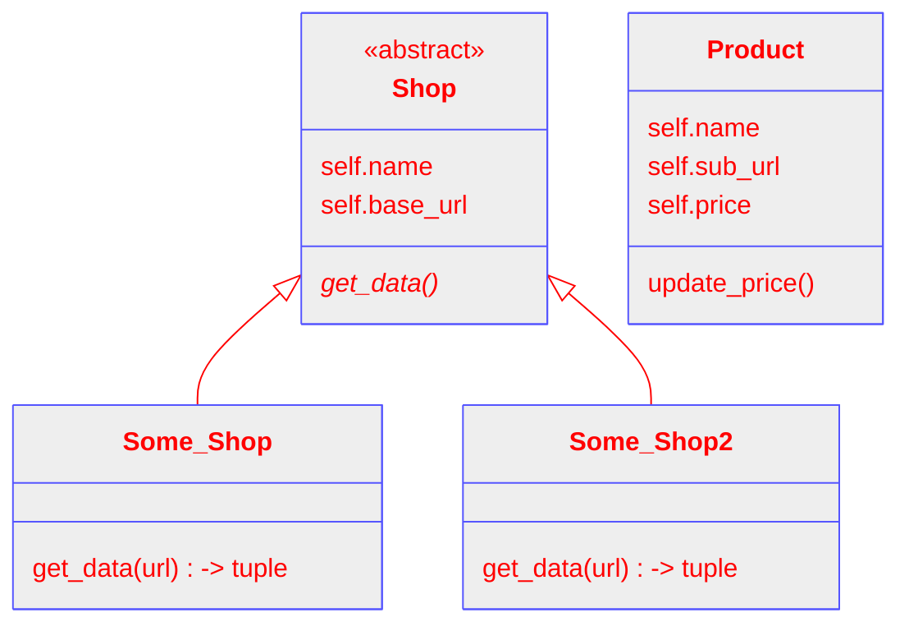

# Projektplanering - "I dno, nån prisfetcher-grej typ"

## Vad ska ditt program göra?

Mitt program ska, beroende på hur långt jag hinner:

```
    - Ta in data om produkter från en eller flera webbutiker.
    - Visa det för användaren i CLI.
    - Spara datan i en databas.
    - Kunna hämta data från databsen och visa den.
```

Det här är ju bara "the basic" base-caset. Det finns ju mycket man kan lägga till som jag spånar på längre ner. Men det är svårt att säga hur lång tid något kommer ta när man inte gjort det förut.

## Vad är motivationen till att skapa det?

För att jag måste.

## Detaljer

### Gränssnitt



write_to_db(class-objekt?) - Skriver data till olika tabeller baserat på om datan är en butik eller produkt?

I dno, man delar väl upp programmet i funktioner som hanterar datan från butiker, och funktioner som hanterar datan i databasen.
Varje produkter är class-objekt med grejer som namn, url och pris.

### Hur förmedlar ditt program sitt resultat

CLI. Kommer inte ha tid att dilla med GUI.

### Vilka operativsystem ska ditt program fungera på?

Alla som kan köra python.

### Externa bibliotek

| Paket    | Beskrivning                            |
| -------- | -------------------------------------- |
| requests | Gör http requests och hämtar data      |
| bs4      | BeatifulSoup, parsar html och xml data |
| sqlite3  | Hanterar data in/ut till databasen     |

## Realistiskt startdatum för utförandet av projektet

Datum: 2024-03-26

Motivering? Börjar väl med research idag.

## Arbetsplan

Version 0.1: Hämta data och få ut relevant information, visa den i terminalen.

Version 0.2: Spara datan i en databas, kunna få ut den därifrån.

```
Grejer man kan bygga på:
    - Spara datan i en databas.
    - Om datan sparas i en atabas, ha en metod för att uppdatera pris.
    - Visa alla grejer formaterade.
    - Lägga till fler butiker för samma produkt.
    - Hämta prisdata för samma produkt i olika färger.
    - Hantera användarinloggning för medlemspriser?
    - Automatisk uppdatering.
    - Statistik över tid.
    - Söka efter produkter direkt i CLI.
    - Leta upp produkter från en butik i andra butiker.
    - GUI
```

[1]: [https://www.youtube.com/watch?v=1-SvuFIQjK8]
[2]: [https://www.atlassian.com/blog/productivity/how-to-write-smart-goals]
